# RVA Contract Lens

**AI-powered procurement intelligence for the City of Richmond.**

Built for [Hack for RVA 2026](https://rvahacks.org) | Pillar 1: A Thriving City Hall | Problem 2: Procurement Risk & Opportunity Review

**Live Demo:** [hackrva.ithena.app](https://hackrva.ithena.app) | **GitHub:** [team-aether](https://github.com/ankitSrivastavaITH/team-aether)

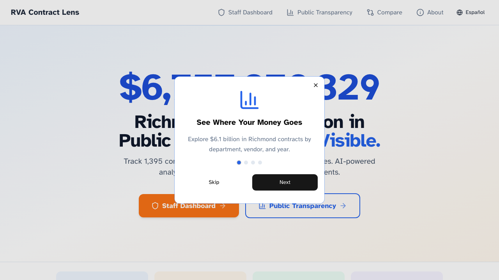

---

## The Problem

City of Richmond procurement staff manage **1,365 contracts worth $6.76 billion** across 37 departments. Today, reviewing a single contract for renewal requires:

- Manually searching **multiple databases** (City, State VITA, Federal SAM.gov)
- Reading through **hundreds of pages** of PDF contract documents
- Checking **federal compliance lists** (FCC, DHS, FBI, FTC) one by one
- Comparing vendor pricing with **no centralized tool**
- Tracking expiration dates across **spreadsheets and emails**

> *"It took me three days to get through all the contract materials to make sure the exact same purchase I made from the year before was still valid. It wasn't."*
> — Deputy Director of IT Strategy, City of Richmond

**Result:** Missed renewals, expired contracts still in use, no visibility into vendor concentration risk, and millions in potential savings left on the table.

---

## The Solution

RVA Contract Lens transforms that 60-minute manual review into an **8-second AI-powered decision brief**. One platform, two audiences.

---

## Staff View: Procurement Intelligence

### Decision-First Dashboard

Staff see what needs action — not a data dump, but three urgency lanes: **Decide Today**, **Plan This Week**, **Review This Month**. Every card links directly to the AI Decision Engine.

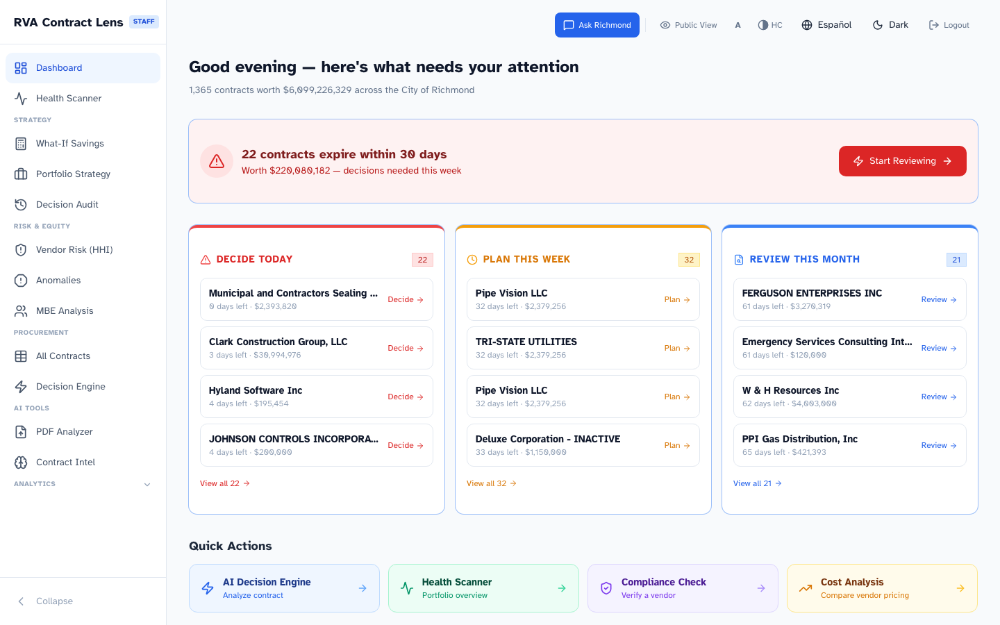

### AI Decision Engine

The core feature. Select a vendor and contract. The system aggregates **8 real data sources**, runs **3 federal compliance checks**, and delivers a **RENEW / REBID / ESCALATE** verdict with full transparency.

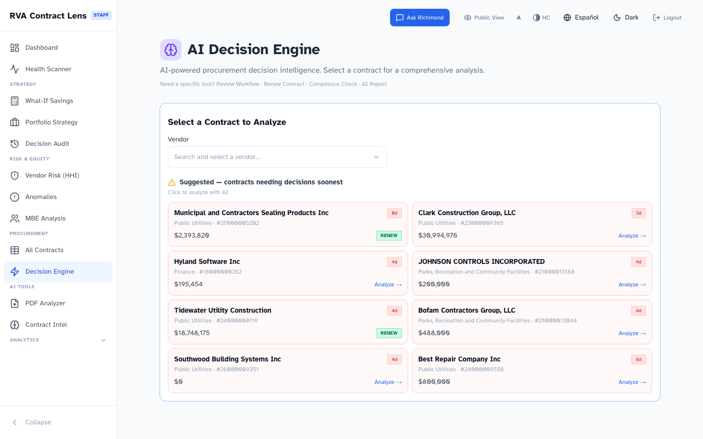

**What the AI analyzes:**

| Source | Type |
|---|---|
| Contract details | DuckDB (value, dates, department, risk level) |
| Vendor history | All contracts for this vendor across departments |
| SAM.gov compliance | Live federal API — exclusions and opportunities |
| FCC Covered List | Prohibited manufacturers (Huawei, ZTE, etc.) |
| Consolidated Screening List | DHS, FBI, FTC sanctioned entities |
| Vendor concentration risk | HHI index — monopoly risk by department |
| PDF contract terms | OCR-extracted clauses via semantic search (ChromaDB) |
| Vendor web intelligence | DuckDuckGo public reviews, news, reputation |

**What staff get back:**
1. Traffic light verdict (RENEW / REBID / ESCALATE) with confidence score
2. Evidence grid — pros and cons with cited data sources
3. Confidence breakdown — signed impact factors (+20 Compliance Clear, -15 Price Increasing)
4. Equity & MBE context — department vendor diversity score
5. Alternative vendors in the same department
6. Exportable decision memo (copy/print)

**The AI recommends. Humans decide.** Every verdict is saved to an audit trail.

### Contract Health Scanner

Grades all 37 departments **A through F** based on contract risk. Collapsible sections for expiry forecast, risk distribution, top anomalies, and department grades.

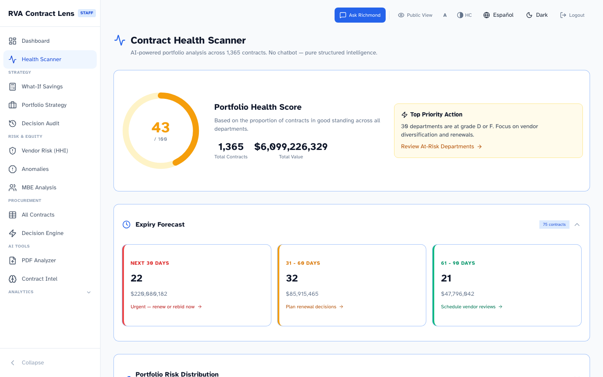

### What-If Savings Estimator

Models the fiscal impact of rebidding concentrated contracts. Three scenarios (5% / 10% / 15%) with **specific vendors to target**, projected savings per department, and **actionable buttons** that link directly to the Decision Engine.

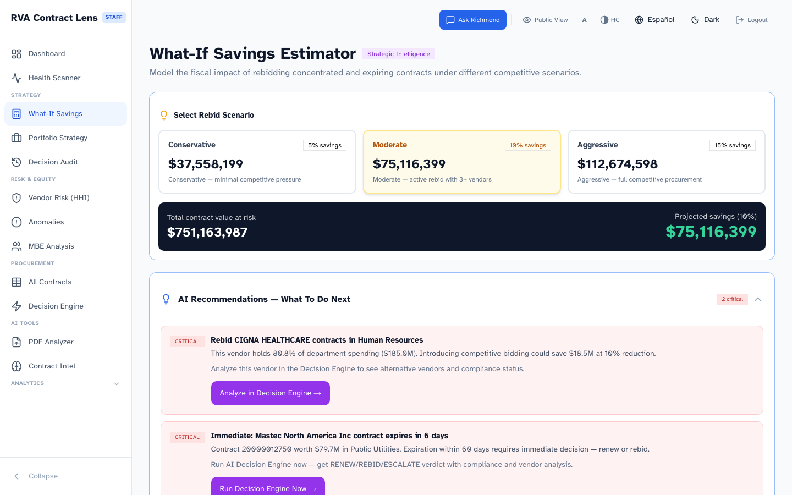

### Portfolio Strategy Advisor

AI-generated procurement strategy **per department**: how many contracts to renew, rebid, or escalate — with projected savings, equity context, and specific action items with links.

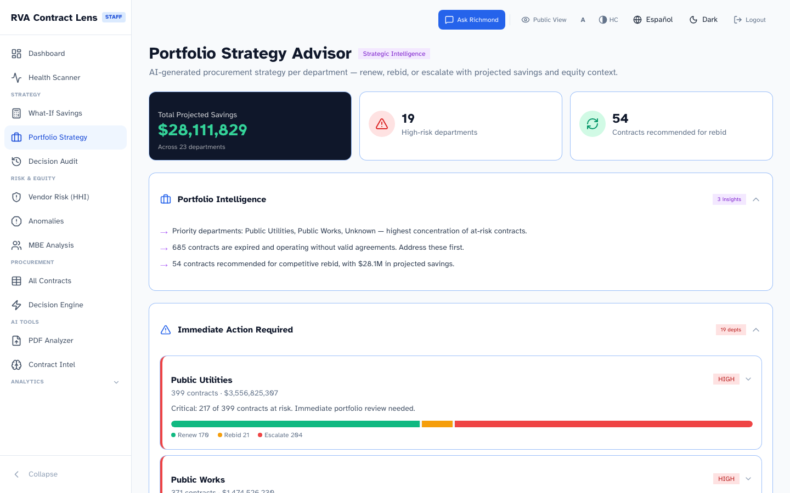

### Decision Audit Timeline

Every AI decision is recorded. Builds **institutional memory** so the next procurement officer inherits data-driven context, not a blank slate. Pattern analysis surfaces trends across the portfolio.

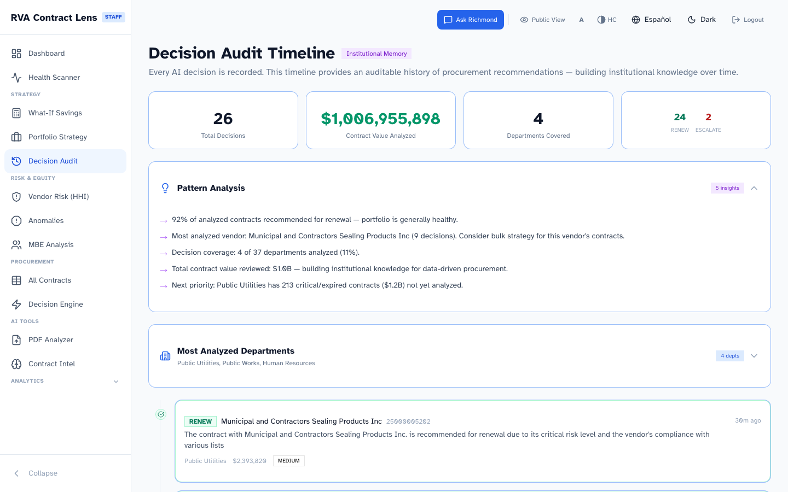

### Vendor Concentration Risk (HHI)

Herfindahl-Hirschman Index analysis identifies departments over-dependent on single vendors. Flags monopoly risk before it becomes a crisis.

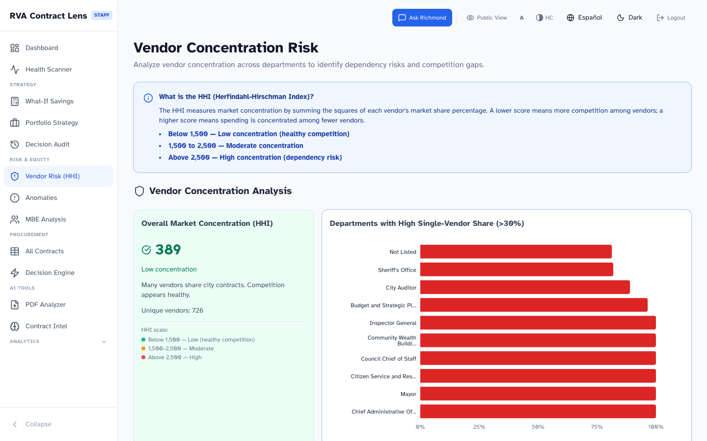

### MBE & Supplier Diversity

Tracks vendor diversity ratios by department, small business participation, and competitive bidding rates. Equity context is embedded in every Decision Engine analysis — not isolated on a separate page.

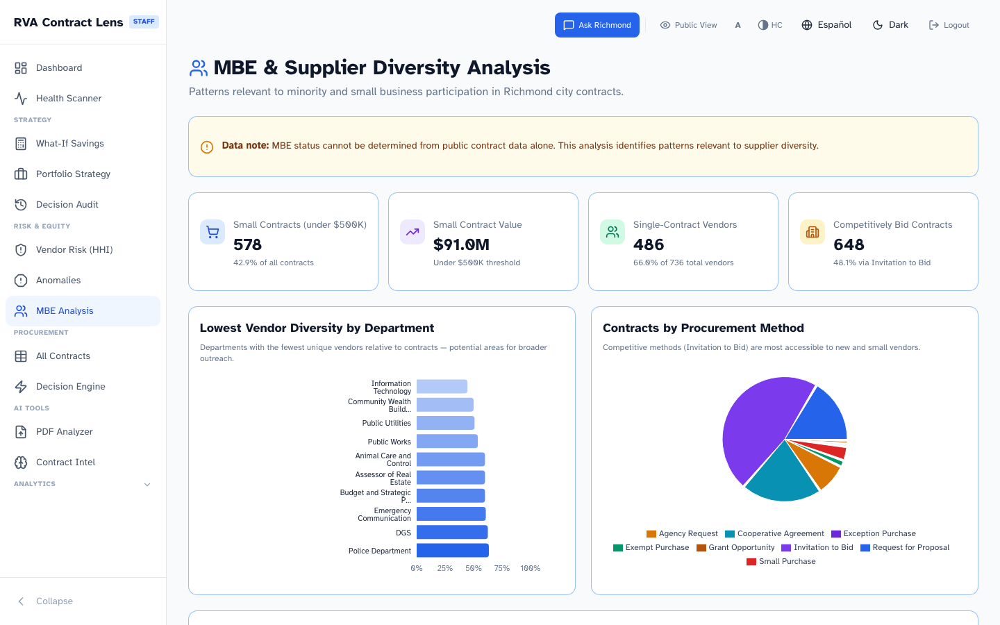

### PDF Analyzer (OCR)

Upload a scanned contract PDF. OCR extracts the full text (176K+ chars from a single document), then AI identifies key terms: value, expiration, renewal clauses, and parties.

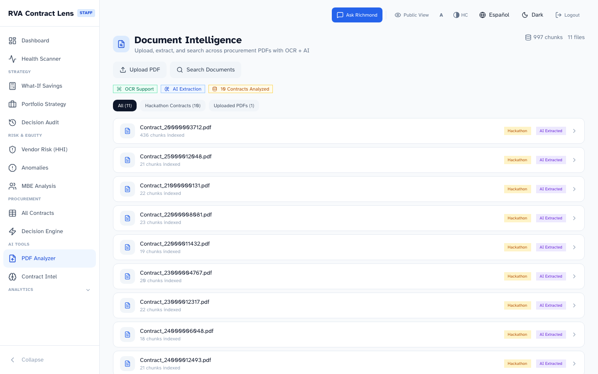

### Ask Richmond (Natural Language Query)

Type a question in plain English: *"Show me expiring IT contracts over $100K."* AI translates it to a database query and returns results instantly.

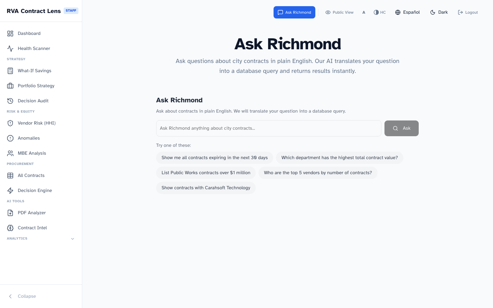

### Anomaly Detection

Risk matrix maps anomalies by severity and likelihood. Each anomaly includes remediation steps and links to the relevant analysis tool.

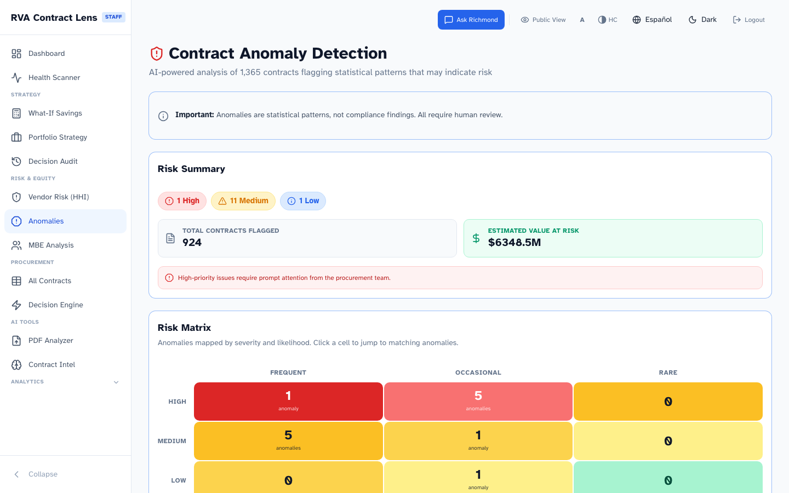

### All Contracts Table

Searchable, sortable, filterable table of all 1,365 contracts. Mobile-responsive card layout. Click any contract to analyze in the Decision Engine.

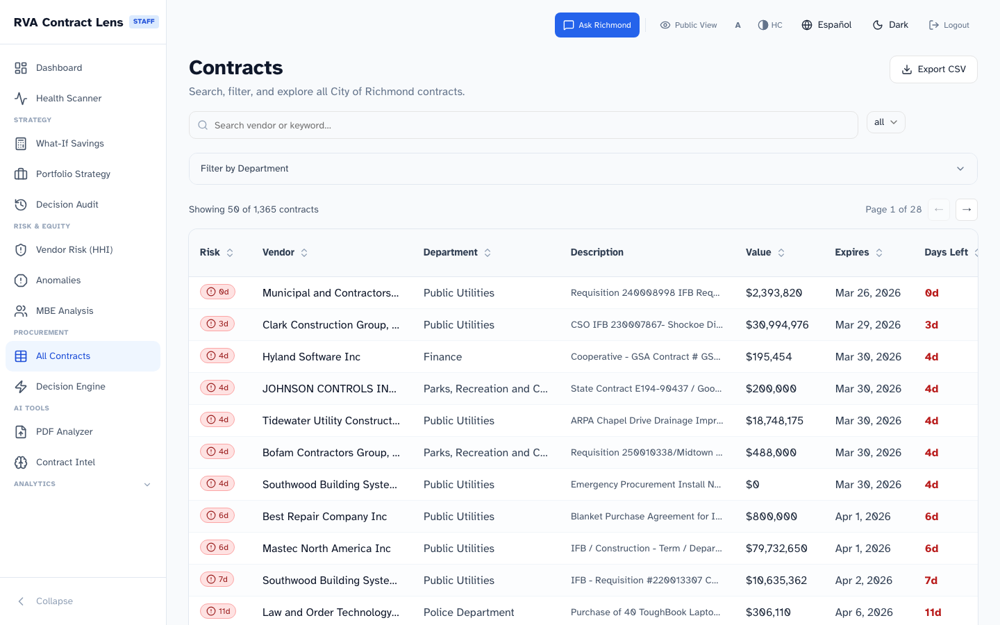

---

## Public View: Fiscal Transparency

### Where Do Your Tax Dollars Go?

Residents can explore **$6.76 billion** in city spending by department, vendor, or service — **without filing a FOIA request**.

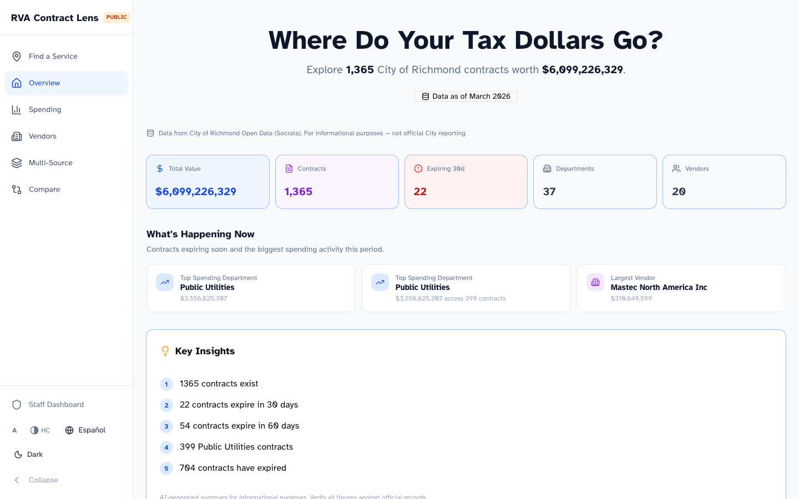

### Spending Breakdown

Interactive charts showing spending by department. Click any department or vendor to drill into their full contract portfolio.

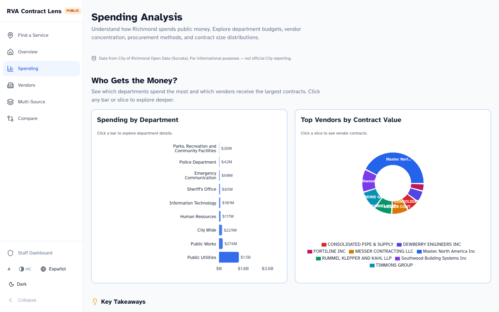

**Additional public pages:** Vendor directory, department detail, Find a Service (20+ categories), and Data Sources (transparency trust signal).

---

## Accessibility & Equity

RVA Contract Lens is designed to work for **everyone**, not just the easiest users.

Every page includes a persistent accessibility toolbar — font scaling, high contrast, bilingual toggle, and dark mode — available to both staff and the public:

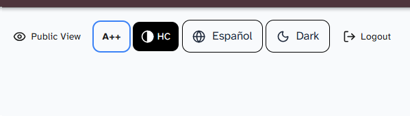

- **Bilingual EN/ES** across all staff pages (30+ translated strings)
- **Atkinson Hyperlegible** font — designed for low-vision and dyslexia accessibility
- **Font size toggle** (A, A+, A++) and **high-contrast mode** on both staff and public pages
- **Skip links** on every page (bilingual) for keyboard and screen reader users
- **44px minimum touch targets** throughout, with `prefers-reduced-motion` support
- **Dark mode** for reduced eye strain and low-light environments
- **MBE/equity context** embedded in the AI Decision Engine — not a separate page, but part of every analysis
- **Public transparency view** so residents with any level of digital literacy can explore city spending

---

## By the Numbers

| Metric | Value |
|---|---|
| Real contracts analyzed | **1,365** ($6.76B) |
| Data sources in Decision Engine | **8** |
| Federal compliance checks | **3** automated (SAM.gov, FCC, CSL) |
| Staff pages | **23** |
| Public transparency pages | **7** |
| API endpoints | **40+** |
| Backend routers | **12** |
| Commits | **155+** |
| Team size | **4 members**, 48 hours |
| Manual review time saved | **60 min → 8 sec** per contract |
| OCR extraction capacity | **176K+** chars from a single scanned PDF |

---

## Data Sources (All Real, Zero Synthetic)

| Source | Records | Method | Update Frequency |
|---|---|---|---|
| City of Richmond (Socrata) | 1,365 contracts ($6.76B) | CSV download | Real-time available |
| SAM.gov Federal | Live query | Opportunities API | Real-time |
| eVA Virginia State | Seeded | State procurement data | Periodic |
| VITA IT Contracts | Seeded | State IT procurement | Periodic |
| FCC Covered List | 10+ entities | Keyword matching | Updated with FCC releases |
| Consolidated Screening List | 10+ entities | Keyword matching | Updated with federal releases |
| Hackathon PDFs | 10 contracts (206 chunks) | OCR via `unstructured` | On upload |
| DuckDuckGo Web Intel | Live search | HTML scraping | Real-time |

---

## Quick Start

```bash
# Clone
git clone https://github.com/ankitSrivastavaITH/team-aether.git
cd team-aether

# Backend
cd backend
pip install -r requirements.txt
echo "GROQ_API_KEY=your_key_here" > .env    # Get free key at console.groq.com
python -m uvicorn app.main:app --port 8200 --reload

# Frontend (new terminal)
cd frontend
npm install
npm run dev -- -p 3200
```

- Frontend: http://localhost:3200
- Backend API docs: http://localhost:8200/docs
- Get a free Groq API key at [console.groq.com](https://console.groq.com)

---

## Full System Architecture

```
┌─────────────────────────────────────────────────────────────────────────┐
│                          DATA INGESTION LAYER                          │
├──────────────┬──────────────┬──────────────┬──────────────┬────────────┤
│   Socrata    │   SAM.gov    │  eVA / VITA  │  PDF Upload  │  Web Scrape│
│   CSV API    │Opportunities │  State CSV   │  (contract   │ DuckDuckGo │
│  1,365 rows  │   Live API   │   Seeded     │  documents)  │   Lite     │
│   ($6.76B)    │              │              │              │            │
└──────┬───────┴──────┬───────┴──────┬───────┴──────┬───────┴─────┬──────┘
       │              │              │              │             │
       v              v              v              v             v
┌─────────────────────────────────────────────────────────────────────────┐
│                         PROCESSING LAYER                               │
│                                                                        │
│  ┌──────────────────┐  ┌──────────────────┐  ┌──────────────────────┐  │
│  │  CSV → DuckDB    │  │   OCR Pipeline   │  │  Compliance Engine   │  │
│  │  Ingest scripts  │  │  `unstructured`  │  │                      │  │
│  │  (pandas/polars) │  │  library         │  │  SAM.gov API (live)  │  │
│  │                  │  │  176K+ chars     │  │  FCC Covered List    │  │
│  │  city_contracts  │  │  per document    │  │  Consolidated Screen │  │
│  │  state_contracts │  │       │          │  │  List (DHS/FBI/FTC)  │  │
│  │  vita_contracts  │  │       v          │  │                      │  │
│  └────────┬─────────┘  │  Chunking +      │  └──────────┬───────────┘  │
│           │            │  Embedding        │             │              │
│           │            └────────┬──────────┘             │              │
└───────────┼─────────────────────┼────────────────────────┼──────────────┘
            │                     │                        │
            v                     v                        v
┌─────────────────────────────────────────────────────────────────────────┐
│                          STORAGE LAYER                                 │
│                                                                        │
│  ┌──────────────────────────┐    ┌──────────────────────────────────┐  │
│  │       DuckDB             │    │          ChromaDB                │  │
│  │   (Embedded Analytics)   │    │       (Vector Store)             │  │
│  │                          │    │                                  │  │
│  │  city_contracts (1,365)  │    │  pdf_chunks (206 embeddings)    │  │
│  │  state_contracts         │    │  semantic similarity search     │  │
│  │  vita_contracts          │    │  used by Decision Engine for    │  │
│  │  extracted_terms (9)     │    │  contract term cross-reference  │  │
│  │  decisions (audit trail) │    │                                  │  │
│  └──────────────────────────┘    └──────────────────────────────────┘  │
└───────────────────────────┬────────────────────────────────────────────┘
                            │
                            v
┌─────────────────────────────────────────────────────────────────────────┐
│                     FastAPI BACKEND (12 Routers)                       │
│                                                                        │
│  /contracts  /decision  /strategy    /health-scan  /analytics          │
│  /nl-query   /extract   /insights    /mbe          /services           │
│  /parser                                                               │
│                                                                        │
│  Key: async parallel compliance checks, rate limiting (slowapi),       │
│       decision persistence, robust JSON fallback parsing               │
└───────────────────────────┬────────────────────────────────────────────┘
                            │
                            v
┌─────────────────────────────────────────────────────────────────────────┐
│                      AI / LLM LAYER (Groq)                             │
│                                                                        │
│  Model: llama-3.3-70b-versatile (primary)                             │
│  Fallback: llama-3.1-8b-instant (rate limit cascade)                  │
│  Recovery: Regex extraction from malformed JSON                       │
│                                                                        │
│  Used for:                                                             │
│  - Decision Engine (8-source → RENEW/REBID/ESCALATE verdict)          │
│  - NL-to-SQL translation (plain English → DuckDB query)               │
│  - Contract term extraction (PDF → structured fields)                 │
│  - Risk summaries (portfolio-level AI insights)                       │
└───────────────────────────┬────────────────────────────────────────────┘
                            │
                            v
┌─────────────────────────────────────────────────────────────────────────┐
│                     FRONTEND (Next.js 14)                              │
│                                                                        │
│  STAFF (23 pages)                  PUBLIC (7 pages)                    │
│  Dashboard, Decision Engine,       Overview, Spending,                 │
│  Health Scanner, What-If,          Vendors, Vendor Detail,             │
│  Portfolio Strategy, Audit,        Department Detail,                  │
│  Risk, MBE, PDF, Ask Richmond,    Find a Service, Sources             │
│  Contracts, Analytics, + more                                          │
│                                                                        │
│  UI: shadcn/ui + Tailwind + Recharts + TanStack Query/Table           │
│  a11y: Atkinson Hyperlegible, i18n EN/ES, skip links, 44px targets    │
└───────────────────────────┬────────────────────────────────────────────┘
                            │
                            v
┌─────────────────────────────────────────────────────────────────────────┐
│  DEPLOYMENT: Docker Compose → Cloudflare Tunnel                       │
│  hackrva.ithena.app (frontend) + api-hackrva.ithena.app (backend)     │
└─────────────────────────────────────────────────────────────────────────┘
```

### Stack

| Layer | Technology | Why |
|---|---|---|
| Frontend | Next.js 14, React 18, Tailwind CSS, shadcn/ui, TanStack Query/Table, Recharts | Fast SSR, component library, real-time data fetching |
| Backend | FastAPI (Python 3.11), 12 routers | Async support, auto-generated API docs, fast development |
| Analytics DB | DuckDB (embedded) | In-process OLAP — no database server needed, handles 1M+ rows |
| Vector DB | ChromaDB | Semantic search over OCR'd PDF chunks |
| AI/LLM | Groq (llama-3.3-70b-versatile) | Free tier, fast inference (< 2 sec), structured JSON output |
| OCR | `unstructured` library | Handles scanned PDFs, images, and mixed-format documents |
| Deployment | Docker Compose + Cloudflare Tunnel | Zero-infrastructure demo deployment |

### Key Technical Decisions

| Decision | Rationale |
|---|---|
| DuckDB over PostgreSQL | Embedded analytics — zero ops, sub-second queries on 1,365 contracts, no server to manage |
| Groq over OpenAI | Free tier (500K tokens/day), fast inference, good JSON output from llama-3.3-70b |
| ChromaDB for PDF search | Lightweight vector DB, persistent storage, semantic similarity on OCR chunks |
| FastAPI over Flask | Async support critical for parallel compliance checks (SAM.gov + FCC + CSL concurrent) |
| shadcn/ui over Material | Accessible by default, composable, Tailwind-native, small bundle size |
| DuckDuckGo Lite over Google | Google blocks HTML scraping; DDG Lite returns parseable HTML results |

---

## Known Limitations

| Limitation | Impact | Mitigation |
|---|---|---|
| Groq free tier rate limits | AI Decision Engine may timeout under heavy concurrent use | 5-second pacing between calls during demo; upgrade to paid tier for production |
| SAM.gov Exclusions API requires Entity Management role | Cannot check debarment directly | Using Opportunities API as proxy; apply for Entity Management access for production |
| Trade.gov CSL API retired | Consolidated Screening List check uses offline keyword matching | Monitor for API replacement; current keyword list covers primary entities |
| DuckDuckGo web search ~3-5 seconds | Adds latency to Decision Engine analysis | Results cached; runs in parallel with other checks |
| MBE status not in public contract data | Cannot definitively identify MBE-certified vendors | Analyze diversity ratios and small business participation as proxy indicators |
| PDF OCR accuracy varies | Scanned documents with poor quality may extract incomplete text | Uses `unstructured` with multiple parsing strategies; manual review always available |

## Future Roadmap

If piloted by the City, the following enhancements would maximize impact:

| Phase | Feature | Value |
|---|---|---|
| **Pilot (0-3 months)** | Connect to City's internal contract management system | Eliminate manual CSV imports, real-time data |
| | Add SAM.gov Entity Management API access | Full debarment checking, not just opportunities |
| | Expand PDF corpus | Ingest all active contract PDFs for comprehensive term extraction |
| **Scale (3-6 months)** | Multi-city deployment | Same platform, different Socrata dataset ID — works for any city with open data |
| | Email/calendar integration | Auto-alert procurement officers 90/60/30 days before expiration |
| | Vendor self-service portal | Vendors update their own MBE certifications, contact info, and capabilities |
| **Transform (6-12 months)** | Predictive risk scoring | ML model trained on historical contract outcomes to predict which contracts will have problems |
| | Cross-jurisdiction price benchmarking | Compare Richmond's contract prices against other Virginia cities and state rates |
| | Automated RFP generation | AI drafts request-for-proposal documents from contract requirements |
| | Legislative compliance tracking | Monitor Virginia procurement law changes and flag affected contracts |

## Testing

```bash
cd backend && pytest tests/ -v
```

5 critical path tests covering health check, contracts API, compliance endpoints, health scanner, and NL query.

## Team

Built by **Team Aether** (4 members) for Hack for RVA 2026.

---

*AI-generated recommendations are advisory only. All procurement decisions require human review and approval per City of Richmond procurement policy.*
